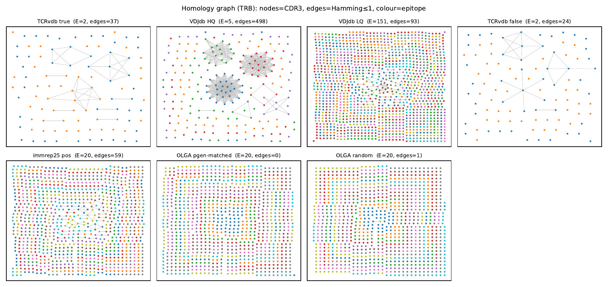

# immrep25 data-quality audit

Does the **immrep25** unseen-peptide benchmark's *positive* TCR–peptide set carry
epitope-specific signal, or only **noise and publicity**? We answer with two
biologically-grounded probes — CDR3 **homology** and V/J **chain pairing** —
calibrated against cohorts of known quality and a generation-probability-matched
random floor.



*Homology graph (TRβ): nodes = CDR3, edges = Hamming ≤ 1, colour = epitope.
Verified cohorts (VDJdb-HQ, TCRvdb-true) form dense epitope-coloured cliques;
**immrep25 and the OLGA random control are near-edgeless point clouds**.*

## Outline

1. [**Cohorts**](src/cohorts.py) — six datasets on a common schema, spanning the
   expected signal-to-noise range (below).
2. [**Homology test**](src/homology.py) — within- vs between-epitope CDR3
   near-neighbour enrichment, per chain, with a [graph view](src/homology_graph.py)
   and a per-epitope breakdown.
3. [**Pairing test**](src/pairing.py) — per-epitope V/J gene-usage bias and
   inter-chain mutual information vs permutation nulls.
4. [**OLGA control**](src/olga_control.py) — pgen-matched random TCRs as the noise floor.
5. [**Publicity control**](src/publicity.py) — is the residual signal just public TCRs?
6. [**Appendix**](appendix/immrep25-audit.pdf) — gnuplot + TikZ LaTeX report.

## Result

**One-vs-many** per epitope (each epitope with ≥30 records scored vs. the rest of its
cohort), aggregated across epitopes (geometric mean ± 95% CI; no bootstrap). Two OLGA
controls fix the noise floor at S/N=1. TRβ:

| cohort | homology S/N (β) | gene-bias (bits) | inter-chain MI (bits) |
|---|--:|--:|--:|
| VDJdb HQ (≥2 refs, either chain) | 1756 | 1.62 | 1.29 |
| TCRvdb true (p_adj<1e-5) | 496 | 0.41 | 1.04 |
| TCRvdb false (p_adj≥1e-5) | 86 | 0.15 | 0.33 |
| VDJdb LQ (1 ref) | 30 | 0.96 | 0.44 |
| **immrep25 positives** | **2.7** | **0.20** | **0.05** |
| AIRR control (real repertoire) | 1.0 | 0.00 | ~0 |
| OLGA pgen-matched | 1.0 | 0.01 | ~0 |
| OLGA random | 1.0 | 0.01 | ~0 |

- immrep25 positives sit **just above the noise floor** (CI excludes 1) and **one to
  three orders of magnitude below every quality cohort**, on both chains and both probes.
- The floor is confirmed by three independent controls — two generative (OLGA) and a
  **real post-thymic-selection repertoire** (AIRR, from [isalgo/airr_control](https://huggingface.co/datasets/isalgo/airr_control)) — all at S/N=1.
- Reported prediction scores agree: IMMREP23 reached median AUC₀.₁ ≳ 0.7 on *seen*
  peptides ([Nielsen 2024](https://doi.org/10.1016/j.immuno.2024.100045)) but IMMREP25's best was macro-AUC₀.₁ = 0.60 on *unseen* — our audit explains why.
- Their weak within-epitope homology is **publicity**: 74.5% are within Hamming≤1 of a
  known VDJdb/TCRvdb TCR; across all 20 epitopes they share just **54** β-neighbours (vs
  **0** for the OLGA control), concentrated in a few epitopes (YLFNADIWI alone = 20).
  Removing public TCRs drops homology S/N to **1.00** (β) / 1.37 (α).
- **Negligible inter-chain α–β coupling** (0.05 bits vs ~1 bit for verified cohorts).
- **Degree check (1-mm neighborhood pgen, à la mirpy):** immrep25 overlaps its point-pgen-matched
  OLGA control (Δ median ≈ 0.01–0.03 dex), so the control captures generation *degree* too —
  the residual homology is not a density artifact. Counterintuitively, the real AIRR repertoire
  (unique clonotypes) has *lower* neighborhood pgen than pgen-weighted OLGA; the S/N floor is
  normalized against random partitions, so it reflects epitope-specificity, not absolute degree.

**Conclusion:** no meaningful epitope-specific signal in the immrep25 positives beyond
noise and publicity — consistent with the benchmark's own finding that models cannot
predict unseen peptides.

## Reproduce

Single conda env `dev` (Python 3.12) runs everything; gnuplot 6, graphviz, TeX Live
are used for the appendix. Install: `pip install -r requirements.txt`.

```bash
bash scripts/fetch_vdjdb.sh        # public VDJdb release into dump/ (not committed)
bash scripts/fetch_airr.sh         # real AIRR control repertoire into cache/ (not committed)
bash scripts/gen_olga_pool.sh      # 100k/chain OLGA pool with pgen, in parallel (GNU parallel)
python src/build_olga.py           # OLGA random + pgen-matched cohorts -> results/olga_*.tsv
python src/build_airr.py           # AIRR real-repertoire control -> results/airr_control.tsv
python run_audit.py                # metrics -> results/*.csv, appendix/analysis/*.dat, macros
python src/compute_1mm.py && python src/analyze_1mm.py   # 1-mm neighborhood pgen (degree check)
python src/figures.py              # matplotlib figures -> results/figures/
make -C appendix                   # gnuplot (tikz) + LaTeX -> appendix/immrep25-audit.pdf
python tests/test_homology.py      # unit tests
```

## Data

- **immrep25** (`dump/immrep25/`) — public, committed. Cite: Richardson et al., *IMMREP25: Unseen Peptides*, bioRxiv 2026, [10.64898/2026.03.30.715276](https://doi.org/10.64898/2026.03.30.715276).
- **VDJdb** — public, **not committed** (large); fetch with `scripts/fetch_vdjdb.sh` from the [2026-06-11 release](https://github.com/antigenomics/vdjdb-db/releases/tag/2026-06-11-ZENODO). Cite: Shugay et al., *Nucleic Acids Research* 2018, [10.1093/nar/gkx760](https://doi.org/10.1093/nar/gkx760).
- **TCRvdb / MATCHMAKERS** — **private, never committed** (results only). Cite: Messemaker et al., bioRxiv 2025, [10.1101/2025.04.28.651095](https://doi.org/10.1101/2025.04.28.651095).
- **Chain pairing** background: Shcherbinin, Belousov & Shugay, *PLoS Comput Biol* 2020, [10.1371/journal.pcbi.1007714](https://doi.org/10.1371/journal.pcbi.1007714).
- **OLGA** generation model: Murugan et al., *PNAS* 2012, [10.1073/pnas.1212755109](https://doi.org/10.1073/pnas.1212755109).

## Method notes

- **One-vs-many**: each epitope (≥30 records) is scored against the rest of its cohort;
  the dataset value is the mean over epitopes (±95% CI = epitope-to-epitope spread), so
  no resampling is needed and the signal attaches to individual epitopes.
- **Homology**: within- vs against-rest CDR3 pairs at Hamming ≤ d (equal-length), as
  *rates* with an exposure-proportional pseudocount so S/N→1 under no enrichment;
  reported for d=1,2,3 (geometric mean over epitopes). d=0 isolates publicity.
- **Pairing**: per-epitope V/J gene-usage bias (KL vs background) and Miller–Madow
  inter-chain MI, each as **excess over a permutation null in bits** (→0 under no signal).
- **Controls (noise floor, S/N=1)**: **OLGA random** (100k/chain pool sampled uniformly),
  **OLGA pgen-matched** (stratified to the immrep25 per-chain pgen), and **AIRR control**
  (1000 real post-thymic-selection clonotypes/chain, reservoir-sampled from a bulk human
  repertoire). All α/β paired at random into immrep-shaped synthetic epitope groups.

Authors: Anna E. Koneva & Mikhail Shugay (ISALGO lab) · correspondence: mikhail.shugay@gmail.com
