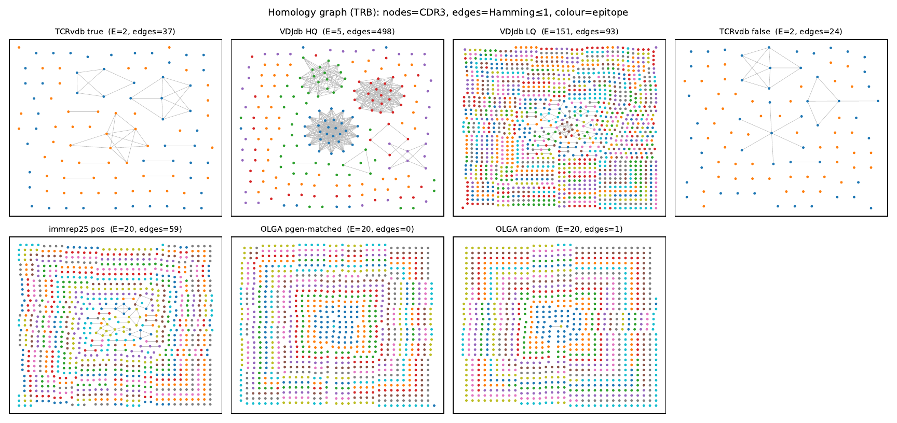

# IMMREP25 data-quality audit

How much epitope-specific signal can the **IMMREP25** unseen-peptide benchmark register at
all? We bound the score any method can reach on it from its negative design and its labels
alone, before any method is run, and then place its positive set with four probes — CDR3
**homology**, V/J **chain pairing**, an **ESM-2** embedding and predicted **interface
geometry** — calibrated against cohorts of known label quality and antigen-free controls.



*Homology graph (TRβ): nodes = CDR3, edges = Hamming ≤ 1, colour = epitope.
Verified cohorts (VDJdb-HQ, TCRvdb-true) form dense epitope-coloured cliques;
**IMMREP25 and the OLGA random control are near-edgeless point clouds**.*

## Outline

1. [**Cohorts**](src/cohorts.py) — ten datasets on a common schema, spanning the
   expected signal-to-noise range (below).
2. [**Homology test**](src/homology.py) — within- vs between-epitope CDR3
   near-neighbour enrichment, per chain, with a [graph view](src/homology_graph.py)
   and a per-epitope breakdown.
3. [**Pairing test**](src/pairing.py) — per-epitope V/J gene-usage bias and
   inter-chain mutual information vs permutation nulls.
4. [**Controls**](src/build_pairseq.py) — antigen-free floors: a real pooled repertoire, an
   OLGA-generated pool, and a [mock benchmark](src/build_pairseq.py) built by IMMREP25's own
   selection rule over a peptide-free plate.
5. [**Publicity control**](src/publicity.py) — is the residual signal just public TCRs?
6. [**Benchmark bounds**](src/blind_ceiling.py) — what the design caps before any method
   runs: the [within-MHC negative construction](src/negative_design.py) and the
   [label-noise ceiling](src/validation_efficiency.py).

## Result

**One-vs-many** per epitope: each epitope with ≥30 records is scored against the rest of its
cohort and the cohort value is the geometric mean over its epitopes, with a 95% CI from the
epitope-to-epitope spread (no bootstrap). Antigen-free controls fix the background at S/N = 1.
TCRβ at Hamming ≤ 1, read from `results/homology_sn.csv` and `results/pairing.csv`:

| cohort | homology S/N (β) | 95% CI | epitopes | V/J gene bias, β (bits) | inter-chain MI (bits) |
|---|--:|:--:|--:|--:|--:|
| TCRvdb positives (functionally validated) | **149** | 109–204 | 2 | 0.42 | 1.04 |
| TCRvdb negatives (screen did not reproduce) | 27.9 | 16.0–48.6 | 2 | 0.20 | 0.33 |
| VDJdb high-confidence (≥2 studies) | **14.8** | 11.5–19.0 | 83 | 0.46 | 0.51 |
| IMMREP22 positives (*seen*-peptide benchmark) | 4.06 | 1.21–13.6 | 7 | 0.38 | 0.28 |
| VDJdb low-confidence (1 study) | 3.49 | 2.38–5.12 | 50 | 0.22 | 0.17 |
| **IMMREP25 positives** | **2.38** | **1.48–3.82** | **20** | **0.17** | **0.05** |
| MLR expanded (real proliferating β clones) | 1.97 | 1.31–2.96 | 12 | — | — |
| AIRR random (pooled real repertoire, random labels) | 1.00 | 1.00–1.00 | 20 | 0.02 | −0.00 |
| OLGA random (raw generation) | 0.97 | 0.96–0.99 | 20 | 0.01 | −0.00 |
| pairSEQ mock (plate that never saw a peptide) | 0.95 | 0.86–1.05 | 20 | 0.04 | −0.00 |

- The IMMREP25 positives sit **just above the background** and **one to two orders of
  magnitude below every independently characterised cohort**, on both chains and both probes.
  The ordering is the point: the ladder is calibrated, so the benchmark's position on it is
  measured rather than asserted.
- Two antigen-free controls reach the same place. **MLR expanded** — real *proliferating*
  TCRβ clones from mixed-lymphocyte reactions — gives S/N **1.97** [1.31, 2.96],
  statistically indistinguishable from IMMREP25's **2.38**: clonal expansion alone reproduces
  the benchmark's homology without any epitope-specific convergence. The **pairSEQ mock**,
  built by running IMMREP25's own selection and post-hoc pairing over a plate to which no
  peptide was ever added, matches it field for field and sits at **0.95**.
- The residual excess is **publicity**, not epitope specificity: **68.4%** of the positives
  lie within Hamming ≤ 1 of a known VDJdb or TCRvdb receptor, and across all 20 epitopes they
  share only **40** within-epitope β-neighbour pairs. Removing the public fraction leaves
  **316** novel positives and takes homology S/N to **1.00** (β) and **1.28** (α) — the
  background.
- **Negligible inter-chain α–β coupling** (0.05 bits, against ~1 bit for the validated set).
- Generation propensity does not explain it. The 1-mismatch neighbourhood Pₑₘ varies widely
  across cohorts, yet every control still sits at S/N ≈ 1: the statistic is normalised against
  random partitions, so it reflects epitope specificity and not absolute generation degree.
- The benchmark's own scores agree. IMMREP23 reached median AUC₀.₁ ≳ 0.7 on *seen* peptides
  ([Nielsen 2024](https://doi.org/10.1016/j.immuno.2024.100045)); IMMREP25's best of 124
  scored entries was macro-AUC₀.₁ **0.601467** on *unseen* peptides.

**Conclusion:** what the IMMREP25 positive set carries is little and bounded — close to an
unselected repertoire once publicity is accounted for, and below what its own negative design
and label quality allow any method to register. That is a property of the benchmark, not a
verdict on the methods ranked with it.

## Reproduce

`uv` env (`requires-python >= 3.11`; results reported here were produced on 3.13.14, `pyproject.toml` + `uv.lock`): `uv sync --extra gen --extra embed`, then
prefix commands with `uv run` (or `source .venv/bin/activate`). The two extras are needed by the
pipeline below and are NOT installed by a bare `uv sync`: `gen` brings OLGA, which
`src/compute_1mm.py` and `src/olga_control.py` import, and `embed` brings torch/transformers for
`src/esm_signal.py`. Plain `uv sync` is enough only to re-derive results from the shipped
`cache/esm/*.npy` and `results/struct_desc_*.tsv`. gnuplot 6 and graphviz build the figures. The manuscript
itself is kept in a separate repository; every number it prints comes from a macro file written by
the steps below, and a missing macro is a hard LaTeX failure, so it cannot quote a value this
pipeline did not produce. Provenance for every artefact is in [SOURCES.md](SOURCES.md).

```bash
# 0. fetch inputs (none are committed)
bash dump/scripts/fetch_vdjdb.sh          # public VDJdb release -> dump/
bash dump/scripts/fetch_immrep22.sh       # IMMREP22 true positives (seen benchmark) -> dump/immrep22/
bash dump/scripts/fetch_airr.sh           # AIRR pooled + SRA donors -> cache/
bash dump/scripts/fetch_mlr.sh            # MLR proliferating samples -> cache/
bash dump/scripts/fetch_pairseq.sh        # pairSEQ plates -> cache/
bash dump/scripts/gen_olga_pool.sh        # 100k/chain OLGA pool with pgen (GNU parallel)
python tools/build_epitope_hla.py         # epitope -> HLA map used by every per-epitope table

# 1. controls
python src/build_olga.py                  # OLGA random          -> results/olga_random.tsv
python src/build_airr.py                  # AIRR random + donors -> results/airr_*.tsv
python src/build_mlr.py                   # MLR expanded, beta   -> results/mlr_prolif.tsv
python src/build_pairseq.py               # pairSEQ mock         -> results/pairseq_mock.tsv
python src/build_dcode.py                 # 10x dextramer set    -> dump/dcode/dcode_clonotypes.tsv
# src/olga_control.py is a library (pgen matching and generation), imported by build_olga.py
# and compute_1mm.py; running it directly only prints a timing check.

# 2. model-free probes and the cohort ladder
python src/vdjdb_exclusions.py            # phage / dextramer overlaps -> vdjdb_excl_macros
python run_audit.py                       # homology, pairing, publicity, graphs, Tables S2-S5
python src/cohort_counts.py               # Table S1 (records and qualifying epitopes per cohort)
python src/compute_1mm.py && python src/analyze_1mm.py    # 1-mismatch neighbourhood pgen
python src/methods_numbers.py             # the Methods numbers no other script emits

# 3. learned representations (ESM-2; embeddings cached in cache/esm/, not committed)
python src/esm_signal.py                  # embedding separation + the cached embeddings
python src/esm_pca.py                     # one global PCA per chain -> cache/esm/pca_{A,B}.npz
python src/esm_cluster.py                 # Leiden ARI/AMI (~25 min: 1000 bootstrap partitions)
python src/degenerate.py                  # held-out learning, memorisation gap, learning curve
python src/mi_master.py                   # every representation on one U = I/H(A) scale
python src/panel1_q.py && python src/panel2_ce.py         # tcrdist3 Q and held-out gain G

# 4. benchmark-level arguments and independent controls
python src/validation_efficiency.py       # label-noise ceiling 1 - f/2
python src/germline_baseline.py           # germline-only baseline + ROC (withdrawn from the
                                         # manuscript; utility.py still reads its ROC)
python src/peptide_table.py               # 20 peptides, HLA + NetMHCpan presentation
python src/dcode_control.py               # 10x dextramer positive control
python src/mira_covid.py                  # ImmuneCODE MIRA-COVID positive control

# 5. structure (predicted complexes; pull them first, see SOURCES.md)
python src/structure_signal.py            # interface epitope convergence
python src/iptm_compare.py                # folding confidence by cohort and epitope
python src/contact_gof.py                 # contact-potential goodness of fit
python src/probe_params.py                # Table S9, read out of the modules themselves

# 6. bounds, learned baselines and the matched-geometry comparison
#    (added at revision; these produce the results the response to reviewers cites)
python src/negative_design.py             # within-MHC negative design: any peptide-blind
                                          # scorer is pinned at chance, Sum_p AUC_p = K/2
python src/scored_geometry.py             # peptide-blind cap on the 18 pools actually scored
python src/informativeness.py             # three-channel ordering: f transfers as a LOWER bound
python src/validation_efficiency.py       # (above) the 1 - f/2 ceiling and its crossover
python src/epitope_free.py                # receptor-only scores across 126 score x allele cells
python src/pairwise.py                    # 187-feature pairwise cognate/non-cognate discriminator
python src/transfer_germline.py           # trained on VDJdb, scored blind on IMMREP25,
                                          # with the probe-power control inside VDJdb
python src/cohort_stats.py                # size-matched rarefaction + minimum detectable effect
python src/covariates.py                  # HC3 covariate adjustment of the cohort effect
python src/iptm_predictor.py              # ipTM on biological vs combinatorial negatives
python src/transferability.py             # confidence transfer by negative class; Table S9
python src/reproducibility.py             # cohort overlap matrix, package versions, seeds

# 6b. the two embedding comparisons. These need a SECOND environment: `sceptr` is deliberately
#     absent from pyproject.toml because it downgrades pandas, so the embedders live in
#     `.venv-embed` and hand off through .npy files. Run the cache step there, the scoring
#     step in the main env. Build it once with
#     `uv venv .venv-embed --python 3.11 && VIRTUAL_ENV=.venv-embed uv pip install sceptr torch transformers`.
python src/embed_cache.py                 # [.venv-embed] SCEPTR + its published ablations,
                                          # ESM-2 at two scales, TCR-BERT -> cache/embed/
python src/embedding_comparison.py        # 14 representations, one fixed protocol
python src/learnability_embed.py          # [.venv-embed] background PCA bases + panel embeddings
python src/learnability.py                # one model, VDJdb vs IMMREP25, matched geometry;
                                          # macro-AUC0.1, information gain G, DeltaAIC, Table S10

# 7. figures and tests
python src/figures.py                     # matplotlib panels -> results/figures/
python tests/test_homology.py             # unit tests
```

## Data

- **immrep25** (`dump/immrep25/`) — public, committed. Cite: Richardson et al., *IMMREP25: Unseen Peptides*, bioRxiv 2026, [10.64898/2026.03.30.715276](https://doi.org/10.64898/2026.03.30.715276).
- **VDJdb** — public, **not committed** (large); fetch with `dump/scripts/fetch_vdjdb.sh` from the [2026-06-11 release](https://github.com/antigenomics/vdjdb-db/releases/tag/2026-06-11-ZENODO). Cite: Shugay et al., *Nucleic Acids Research* 2018, [10.1093/nar/gkx760](https://doi.org/10.1093/nar/gkx760).
- **TCRvdb / MATCHMAKERS** — **private, never committed** (results only). Cite: Messemaker et al., bioRxiv 2025, [10.1101/2025.04.28.651095](https://doi.org/10.1101/2025.04.28.651095).
- **Chain pairing** background: Shcherbinin, Belousov & Shugay, *PLoS Comput Biol* 2020, [10.1371/journal.pcbi.1007714](https://doi.org/10.1371/journal.pcbi.1007714).
- **OLGA** generation model: Murugan et al., *PNAS* 2012, [10.1073/pnas.1212755109](https://doi.org/10.1073/pnas.1212755109).
- **MLR expanded** (proliferating β clones): Emerson, Mathew, Konieczna, Robins & Leventhal (Adaptive immunoSEQ), *PLoS ONE* 2014, [10.1371/journal.pone.0111943](https://doi.org/10.1371/journal.pone.0111943).

## Method notes

- **One-vs-many**: each epitope (≥30 records) is scored against the rest of its cohort;
  the dataset value is the mean over epitopes (±95% CI = epitope-to-epitope spread), so
  no resampling is needed and the signal attaches to individual epitopes.
- **Homology**: within- vs against-rest CDR3 pairs at Hamming ≤ d (equal-length), as
  *rates* with an exposure-proportional pseudocount so S/N→1 under no enrichment;
  reported for d=1,2,3 (geometric mean over epitopes). d=0 isolates publicity.
- **Pairing**: per-epitope V/J gene-usage bias (KL vs background) and Miller–Madow
  inter-chain MI, each as **excess over a permutation null in bits** (→0 under no signal).
- **Controls (background)**: **OLGA random** (100k/chain pool sampled uniformly), **AIRR
  random** (unique clonotypes reservoir-sampled from a pooled human repertoire,
  isalgo/airr_control), and the **pairSEQ mock** (IMMREP25's own selection rule and post-hoc
  chain pairing run over a peptide-free plate). The first two carry random epitope labels;
  the mock carries the benchmark's own construction with the antigen removed, which is what
  makes it the informative one.
- **MLR expanded (β-only MIRA-analogue)**: real proliferating TCRβ clones from
  mixed-lymphocyte reactions (isalgo/airr_benchmark `alice/mlr`); each replicate's top-200
  β clonotypes = one virtual epitope (12 across 3 reactions), scored one-vs-many against the
  *other reactions only* (same-reaction replicates share the same expanded clones). Mimics
  how IMMREP25's positives were generated (expanded β clones, α added afterward).

Authors: Anna E. Koneva & Mikhail Shugay (ISALGO lab) · correspondence: mikhail.shugay@gmail.com
